# Auto-Blog AI System

Automatisches Blog-System mit Python Backend, LLM-Integration (OpenAI), Termlabs SEO-Keyword-Analyse und Astro Frontend. Generiert hochwertige Blog-Artikel basierend auf Content-Chunks mit automatischer Keyword-Optimierung.

---

## 📋 Inhaltsverzeichnis

1. [Übersicht](#übersicht)
2. [Architektur](#architektur)
3. [Installation](#installation)
4. [Initial Setup](#initial-setup)
5. [Konfiguration](#konfiguration)
6. [Datenbank](#datenbank)
7. [Python-Module](#python-module)
8. [API-Endpoints](#api-endpoints)
9. [Start-Möglichkeiten](#start-möglichkeiten)
10. [Testing](#testing)
11. [Automatische Generierung](#automatische-generierung)
12. [Workflows](#workflows)
13. [Troubleshooting](#troubleshooting)

---

## 🎯 Übersicht

Das Auto-Blog AI System ist eine vollständige Lösung zur automatischen Generierung von Blog-Artikeln:

- **Content-Import**: Markdown/TXT-Dateien werden in Chunks aufgeteilt und in SQLite gespeichert
- **Chunk-Tracking**: Systematische Rotation durch Content-Pool, keine Wiederholungen
- **LLM-Integration**: Hochwertige Artikel-Generierung mit OpenAI GPT-4o-mini
- **SEO-Optimierung**: Automatische Keyword-Extraktion und Termlabs-Integration
- **Automatisches Scheduling**: Tägliche/wöchentliche Post-Generierung
- **Volltextsuche**: FTS5-basierte Suche für relevante Content-Auswahl

---

## 🏗️ Architektur

```
┌─────────────────┐
│   Frontend      │  Astro (React-basiert)
│   (Astro)       │  └─ Blog-Artikel anzeigen
└─────────────────┘
        │
        │ HTTP
        ▼
┌─────────────────┐
│   Backend API   │  FastAPI (Python)
│   (app.py)      │  └─ REST-Endpoints
└─────────────────┘
        │
        ├─► SQLite DB ──► Content Chunks, Posts
        ├─► OpenAI API ──► Artikel-Generierung
        ├─► Termlabs API ─► SEO-Keyword-Analyse
        └─► Scheduler ────► Automatische Posts
```

---

## 🔧 Backend-Architektur & Chunk-Pipeline

### Übersicht

Das Backend ist eine FastAPI-Anwendung, die Content in intelligente Chunks aufteilt, diese in einer SQLite-Datenbank speichert und für die automatische Artikel-Generierung nutzt. Der Kernprozess besteht aus drei Hauptphasen:

1. **Chunk-Erstellung** (Ingestion): Textdateien werden in semantisch sinnvolle Chunks aufgeteilt
2. **Chunk-Verarbeitung** (Retrieval & Filtering): Relevante Chunks werden gesucht, gefiltert und validiert
3. **Chunk-Nutzung** (Generation): Chunks werden für LLM-basierte Artikel-Generierung verwendet

### Chunk-Erstellung (Ingestion)

#### Prozessablauf

Die Chunk-Erstellung erfolgt in `apps/backend/ingest.py` und durchläuft folgende Schritte:

```
Textdatei (.md/.txt)
    ↓
SHA256-Hash berechnen (Deduplizierung)
    ↓
Text in Blöcke aufteilen (an Überschriften)
    ↓
Blöcke in Chunks aufteilen (350 Wörter, 60 Overlap)
    ↓
Chunks in Datenbank speichern (Document + DocumentChunk)
    ↓
FTS5-Index aktualisiert (automatisch via Trigger)
```

#### Deduplizierung

Jede Datei wird mit SHA256 gehasht (`_sha256()` in `ingest.py`):
- Existiert bereits ein `Document` mit gleichem Hash → Datei wird übersprungen
- Neuer Hash → Datei wird verarbeitet
- Verhindert doppelte Inhalte in der Datenbank

#### Block-Aufteilung

Die Funktion `_split_blocks_by_headings()` teilt Text an Überschriften auf:

1. **Primär-Strategie**: Aufteilung an Markdown-Überschriften (`#`, `##`, etc.)
   - Jeder Block beginnt mit einer Überschrift
   - Überschriften werden im Block mitgespeichert
   - Erhält semantische Struktur

2. **Fallback-Strategie**: Wenn keine Überschriften gefunden werden
   - Aufteilung an doppelten Zeilenumbrüchen (`\n\n`)
   - Jeder Absatz wird zu einem Block

#### Rechunking

Die Funktion `_rechunk()` teilt große Blöcke in Chunks mit fester Größe auf:

- **MAX_WORDS**: 350 Wörter pro Chunk (Standard)
- **OVERLAP_WORDS**: 60 Wörter Overlap zwischen Chunks
- **Overlap-Logik**: 
  - Chunk 1: Wörter 0-350
  - Chunk 2: Wörter 290-640 (beginnt bei 350-60=290)
  - Chunk 3: Wörter 580-930 (beginnt bei 640-60=580)
  - etc.

**Warum Overlap?**
- Verhindert, dass wichtige Informationen an Chunk-Grenzen verloren gehen
- Erhöht Kontext für FTS-Suche
- Verbessert semantische Kohärenz bei Artikel-Generierung

#### Datenbank-Persistierung

Nach der Chunk-Erstellung werden Daten in SQLite gespeichert:

1. **Document**-Eintrag:
   - `title`: Dateiname (ohne Extension)
   - `source_path`: Vollständiger Pfad zur Datei
   - `sha256`: Hash für Deduplizierung
   - `created_at`: Zeitstempel

2. **DocumentChunk**-Einträge (pro Chunk):
   - `document_id`: Foreign Key zu `Document`
   - `idx`: Index innerhalb des Dokuments (0, 1, 2, ...)
   - `text`: Chunk-Text (Text-Spalte, unbegrenzt)
   - `used_count`: Anzahl Verwendungen (Start: 0)
   - `last_used_at`: Letzte Verwendung (Start: NULL)

3. **FTS5-Index** (automatisch):
   - Virtuelle Tabelle `chunks_fts` wird via Trigger aktualisiert
   - Jeder neue Chunk wird automatisch indiziert
   - Ermöglicht schnelle Volltextsuche mit BM25-Scoring

### Chunk-Verarbeitung & Validierung

#### Chunk-Retrieval

Die Funktion `retrieve_chunks()` in `apps/backend/generator.py` holt Chunks aus der Datenbank:

**Priorisierung (wenn `prioritize_unused=True`):**
1. Chunks mit `used_count=0` (noch nie verwendet)
2. Dann nach `used_count` aufsteigend sortiert
3. Bei gleichem `used_count`: nach `last_used_at` (älteste zuerst)
4. Bei NULL `last_used_at`: werden als älteste behandelt

**Ziel**: Systematische Rotation durch Content-Pool, keine Wiederholungen

#### Volltextsuche (FTS)

Die Funktion `/search` in `apps/backend/app.py` nutzt FTS5 für semantische Suche:

```sql
SELECT c.id, c.text, bm25(chunks_fts) AS score
FROM chunks_fts
JOIN document_chunks c ON c.id = chunks_fts.rowid
WHERE chunks_fts MATCH :q
ORDER BY score ASC  -- Niedrigerer Score = relevanter
LIMIT :limit
```

**BM25-Scoring**: 
- Niedrigere Scores = höhere Relevanz
- Berücksichtigt Term-Frequenz und Dokument-Länge
- Optimiert für deutsche Texte (Unicode61 Tokenizer)

#### Fenster-basierte Suche

Die Funktion `fetch_window()` in `apps/backend/app.py` holt Chunks aus einem kontextuellen Fenster:

- **Zentrum**: Beste Chunk aus FTS-Suche (`center_idx`)
- **Vorher**: 2 Chunks vor dem Zentrum (`before=2`)
- **Nachher**: 6 Chunks nach dem Zentrum (`after=6`)
- **Ziel**: Erhält semantischen Kontext um relevante Chunks

#### Chunk-Validierung

Vor der Verwendung werden Chunks durch mehrere Filter validiert:

**1. ToC-Erkennung** (`looks_like_toc()` in `apps/backend/app.py`):
```python
# Erkennt Inhaltsverzeichnisse an:
# - Schlagwörtern: "inhaltsverzeichnis", "table of contents"
# - Viele Bullet-Points (≥60% der Zeilen)
# - Nummerierte Listen
```
**Ziel**: Filtert unbrauchbare Inhaltsverzeichnisse aus

**2. Chunk-Bereinigung** (`clean_chunk()` in `apps/backend/app.py`):
```python
# Filtert aus:
# - Leere Chunks
# - Chunks die nur Überschriften enthalten
# - Sehr kurze Chunks (< 120 Zeichen)
```
**Ziel**: Nur qualitativ hochwertige Chunks verwenden

**3. Thematische Validierung** (in `/generate/from-search`):
```python
# Prüft ob Chunks zum Suchbegriff passen:
# - Suchbegriffe müssen in Chunk-Text vorkommen
# - Mindestens 50% der Suchbegriffe müssen gefunden werden
# - Warnung bei niedriger Übereinstimmung
```
**Ziel**: Verhindert thematisch unpassende Artikel

**4. Fallback-Mechanismus**:
- Wenn nach strikter Filterung zu wenige Chunks (< 2):
  - Lockere Mindestlänge auf 50 Zeichen
  - Erlaube kürzere Chunks
  - Ziel: Mindestens 2-3 Chunks für Artikel-Generierung

### Chunk-Nutzung & Tracking

#### Artikel-Generierung

Der Endpoint `/generate/from-search` nutzt Chunks für LLM-basierte Artikel-Generierung:

1. **Chunk-Auswahl**:
   - FTS-Suche findet beste Chunks
   - Fenster-basierte Suche holt Kontext
   - Filterung entfernt unbrauchbare Chunks

2. **LLM-Generierung** (`generate_markdown_from_chunks()` in `apps/backend/llm.py`):
   - Chunks werden als Kontext an LLM gesendet
   - System-Prompt erzwingt: Artikel MUSS auf Chunks basieren
   - SEO-Keywords werden natürlich integriert
   - Ziel: 1200-1500 Wörter, strukturierter Artikel

3. **Post-Processing** (`clean_markdown_body()` in `apps/backend/markdown_cleaner.py`):
   - Korrigiert zu lange Überschriften (> 10 Wörter)
   - Entfernt nummerierte Überschriften
   - Bereinigt Formatierungsfehler

4. **Chunk-Tracking** (`mark_chunks_as_used()` in `apps/backend/generator.py`):
   - `used_count` wird um 1 erhöht
   - `last_used_at` wird auf aktuelle Zeit gesetzt
   - Chunk wird mit Post verknüpft (Many-to-Many: `post_chunks`)

#### Automatische Generierung

Der Scheduler (`apps/backend/scheduler.py`) generiert automatisch Posts:

1. **Zufällige Chunk-Auswahl**:
   - Wählt zufälligen Chunk aus Datenbank
   - Extrahiert Keyword aus Chunk-Text
   - Sucht ähnliche Chunks via FTS

2. **Titel-Generierung**:
   - LLM generiert Titel aus Chunks (`generate_title_from_chunks()`)
   - Fallback: Keywords aus Chunk extrahiert

3. **Keyword-Extraktion**:
   - Keywords aus Titel extrahiert (≥4 Zeichen, keine Stopwords)
   - Optional: Termlabs-Analyse für SEO-Keywords
   - Keywords werden an LLM übergeben

4. **Artikel-Generierung & Tracking**:
   - Wie manuelle Generierung
   - Chunks werden als verwendet markiert
   - Post wird in Datenbank gespeichert

### Datenfluss-Diagramm

```mermaid
flowchart TD
    A[Textdatei .md/.txt] --> B[SHA256 Hash]
    B --> C{Hash existiert?}
    C -->|Ja| D[Überspringen]
    C -->|Nein| E[Text einlesen]
    E --> F[Aufteilen an Überschriften]
    F --> G[Rechunking: 350 Wörter, 60 Overlap]
    G --> H[Document + DocumentChunks speichern]
    H --> I[FTS5-Index aktualisiert]
    
    I --> J[Chunk-Retrieval]
    J --> K{Suchmethode}
    K -->|FTS| L[Volltextsuche mit BM25]
    K -->|Priorisierung| M[Ungenutzte Chunks zuerst]
    L --> N[Fenster-basierte Suche]
    M --> N
    N --> O[Chunk-Validierung]
    
    O --> P{ToC?}
    P -->|Ja| Q[Verwerfen]
    P -->|Nein| R{Zu kurz?}
    R -->|Ja| Q
    R -->|Nein| S{Thematisch passend?}
    S -->|Nein| T[Warnung]
    S -->|Ja| U[Chunks an LLM]
    
    U --> V[Artikel-Generierung]
    V --> W[Post-Processing]
    W --> X[Markdown-Datei speichern]
    X --> Y[Post in DB speichern]
    Y --> Z[Chunks als verwendet markieren]
    Z --> AA[used_count++, last_used_at=now]
```



### Wichtige Konfigurationsparameter

| Parameter | Standard | Beschreibung |
|----------|----------|--------------|
| `MAX_WORDS` | 350 | Wörter pro Chunk |
| `OVERLAP_WORDS` | 60 | Overlap zwischen Chunks |
| FTS Tokenizer | `unicode61 remove_diacritics 2` | Optimiert für deutsche Texte |
| Min. Chunk-Länge | 120 Zeichen | Strikte Filterung |
| Min. Chunk-Länge (Fallback) | 50 Zeichen | Lockere Filterung |
| Max. Überschrift-Länge | 10 Wörter | Wird zu normalem Text |

### Integritätsprüfung

Der Endpoint `/admin/check-integrity` prüft Konsistenz zwischen:
- `used_count` / `last_used_at` in `DocumentChunk`
- Tatsächliche Verknüpfungen in `post_chunks`

**Bei Inkonsistenzen** (mit `fix=true`):
- `used_count` wird aus `post_chunks` berechnet
- `last_used_at` wird aus `post_chunks.used_at` übernommen
- Datenbank wird repariert

---

## 📦 Installation

### Voraussetzungen

- Python 3.8+
- Node.js 18+ (für Frontend)
- Git (optional, für Git-Integration)

### Backend (Python)

```bash
# Virtual Environment erstellen
python3 -m venv .venv
source .venv/bin/activate  # macOS/Linux
# .venv\Scripts\activate  # Windows

# Dependencies installieren
pip install -r apps/backend/requirements.txt
```

### Frontend (Astro)

```bash
cd apps/frontend
npm install
```

---

## 🚀 Initial Setup

### 1. Konfiguration einrichten

Erstelle `.env` Datei im Projekt-Root:

```bash
cat > .env << EOF
# LLM-Konfiguration
USE_LLM=True
OPENAI_API_KEY=sk-dein-openai-api-key-hier

# Automatische Generierung
AUTO_GENERATE_ENABLED=False
AUTO_GENERATE_INTERVAL_HOURS=24

# Termlabs SEO-Keyword-Analyse (optional)
USE_TERMLABS=False
TERMLABS_BEARER_TOKEN=dein-termlabs-bearer-token
TERMLABS_API_KEY=dein-termlabs-api-key

# Weitere Optionen (Standardwerte)
DEFAULT_AUTHOR=AutoBlog
SITE_BASE_URL=https://example.com
EOF
```

### 2. Datenbank initialisieren

Die Datenbank wird automatisch beim ersten Start erstellt. Falls die Datenbank bereits existiert, wird sie verwendet.

**Migration für Chunk-Tracking (falls nötig):**

```bash
python3 apps/backend/migrate_add_tracking.py
```

Dies fügt die Tracking-Felder (`used_count`, `last_used_at`) hinzu und erstellt die `post_chunks` Tabelle.

### 3. Content in Datenbank laden

**Wichtig:** Beim ersten Start muss Content importiert werden!

```bash
# Server starten (siehe Start-Möglichkeiten)
# Dann in einem neuen Terminal:

curl -X POST http://127.0.0.1:8000/ingest/dir \
  -H "Content-Type: application/json" \
  -d '{
    "dir_path": "data/sources",
    "recursive": true
  }'
```

**Was passiert:**
- Alle `.md` und `.txt` Dateien aus `data/sources/` werden eingelesen
- Dateien werden in Chunks aufgeteilt (350 Wörter pro Chunk, 60 Wörter Overlap)
- Chunks werden in SQLite gespeichert
- FTS5-Index wird erstellt für Volltextsuche
- Duplikate werden erkannt (SHA256-Hash)

**Chunking-Parameter:**
- `MAX_WORDS`: 350 Wörter pro Chunk
- `OVERLAP_WORDS`: 60 Wörter Overlap zwischen Chunks
- Chunks werden an Überschriften (`#`) aufgeteilt, falls vorhanden

**Erwartete Ausgabe:**
```json
{"ingested": 5, "files": ["file1.md", "file2.md", ...]}
```

### 4. FTS5-Index prüfen

Der FTS5-Index wird automatisch beim Start erstellt. Falls Probleme auftreten:

```bash
# FTS5-Index wird automatisch in app.py beim Start erstellt
# Siehe: apps/backend/fts.py
```

---

## ⚙️ Konfiguration

### Environment-Variablen (`.env`)

| Variable | Typ | Standard | Beschreibung |
|----------|-----|----------|--------------|
| `USE_LLM` | bool | `False` | Aktiviert LLM-Integration |
| `OPENAI_API_KEY` | string | `None` | OpenAI API Key (erforderlich wenn `USE_LLM=True`) |
| `AUTO_GENERATE_ENABLED` | bool | `False` | Aktiviert automatische Post-Generierung |
| `AUTO_GENERATE_INTERVAL_HOURS` | float | `24.0` | Intervall in Stunden (z.B. `24` = täglich, `0.25` = alle 15 Min) |
| `USE_TERMLABS` | bool | `False` | Aktiviert Termlabs SEO-Keyword-Analyse |
| `TERMLABS_BEARER_TOKEN` | string | `None` | Termlabs Bearer Token (empfohlen) |
| `TERMLABS_API_KEY` | string | `None` | Termlabs API Key (Alternative zu Bearer Token) |
| `DEFAULT_AUTHOR` | string | `"AutoBlog"` | Standard-Autor für Posts |
| `SITE_BASE_URL` | string | `"https://example.com"` | Basis-URL für Canonical Links |

### Datenbank-Pfade (automatisch gesetzt)

- **DB_PATH**: `apps/backend/auto_blog.sqlite3`
- **CONTENT_DIR**: `apps/frontend/src/content/blog/`
- **GIT_REPO_ROOT**: Projekt-Root (für Git-Integration)

---

## 🗄️ Datenbank

### Schema

#### Tabelle: `documents`
Speichert die originalen Dokumente.

| Spalte | Typ | Beschreibung |
|--------|-----|--------------|
| `id` | Integer | Primary Key |
| `title` | String | Dokument-Titel |
| `source_path` | String | Pfad zur Quelldatei |
| `sha256` | String | SHA256-Hash (für Deduplizierung) |
| `mime` | String | MIME-Type (optional) |
| `created_at` | DateTime | Erstellungszeitpunkt |

#### Tabelle: `document_chunks`
Speichert die Text-Chunks der Dokumente.

| Spalte | Typ | Beschreibung |
|--------|-----|--------------|
| `id` | Integer | Primary Key |
| `document_id` | Integer | Foreign Key zu `documents.id` |
| `idx` | Integer | Index innerhalb des Dokuments |
| `text` | Text | Chunk-Text |
| `used_count` | Integer | Wie oft wurde dieser Chunk verwendet? (Default: 0) |
| `last_used_at` | DateTime | Wann wurde er zuletzt verwendet? (nullable) |

#### Tabelle: `posts`
Speichert generierte Blog-Posts.

| Spalte | Typ | Beschreibung |
|--------|-----|--------------|
| `id` | Integer | Primary Key |
| `slug` | String | Eindeutiger Slug (URL-freundlich) |
| `title` | String | Post-Titel |
| `status` | String | `draft`, `scheduled`, `published` |
| `published` | Boolean | Ist veröffentlicht? |
| `scheduled_at` | DateTime | Veröffentlichungszeitpunkt (optional) |
| `md_path` | String | Pfad zur Markdown-Datei |
| `created_at` | DateTime | Erstellungszeitpunkt |

#### Tabelle: `post_chunks`
Many-to-Many Beziehung zwischen Posts und Chunks (Tracking).

| Spalte | Typ | Beschreibung |
|--------|-----|--------------|
| `post_id` | Integer | Foreign Key zu `posts.id` |
| `chunk_id` | Integer | Foreign Key zu `document_chunks.id` |
| `used_at` | DateTime | Zeitstempel der Verwendung |

#### Virtuelle Tabelle: `chunks_fts`
FTS5-Index für Volltextsuche (automatisch synchronisiert).

| Spalte | Typ | Beschreibung |
|--------|-----|--------------|
| `rowid` | Integer | Verknüpft mit `document_chunks.id` |
| `text` | Text | Indizierter Text |

### Datenbank-Zugriff

```python
from apps.backend.db import SessionLocal, engine
from apps.backend.models import Document, DocumentChunk, Post

# Session erstellen
db = SessionLocal()

# Chunks abfragen
chunks = db.query(DocumentChunk).filter(DocumentChunk.used_count == 0).all()

# Dokumente abfragen
docs = db.query(Document).all()

# Posts abfragen
posts = db.query(Post).filter(Post.published == True).all()

db.close()
```

---

## 📁 Python-Module

### Core-Module

#### `app.py` - Haupt-API
FastAPI-Anwendung mit REST-Endpoints.

**Hauptfunktionen:**
- `/ingest/dir` - Content-Import
- `/search` - Volltextsuche
- `/generate/from-search` - Artikel-Generierung mit Suche
- `/generate` - Artikel-Generierung (Fallback)
- `/admin/llm-status` - LLM-Status prüfen
- `/admin/trigger-auto-generate` - Manuelle Auto-Generierung

**Wichtige Funktionen:**
- `gen_from_search()` - Generiert Artikel basierend auf Suche
- `api_generate()` - Generiert Artikel (Fallback)
- `fetch_window()` - Holt Chunks in einem Fenster um einen Index

#### `db.py` - Datenbank-Verbindung
SQLAlchemy-Engine und Session-Management.

**Hauptfunktionen:**
- `engine` - SQLAlchemy Engine (SQLite)
- `SessionLocal` - Session Factory
- `Base` - Declarative Base für Models

#### `models.py` - Datenbank-Modelle
SQLAlchemy ORM-Modelle.

**Modelle:**
- `Document` - Dokument-Modell
- `DocumentChunk` - Chunk-Modell (mit Tracking)
- `Post` - Post-Modell
- `post_chunks` - Many-to-Many Tabelle

#### `settings.py` - Konfiguration
Pydantic Settings für Environment-Variablen.

**Hauptfunktionen:**
- `Settings` - Pydantic Settings-Klasse
- `settings` - Globale Settings-Instanz
- Lädt `.env` Datei automatisch

### Content-Import

#### `ingest.py` - Content-Import
Importiert Markdown/TXT-Dateien in die Datenbank.

**Hauptfunktionen:**
- `ingest_file()` - Importiert eine Datei
- `ingest_directory()` - Importiert ein Verzeichnis rekursiv
- `_robust_chunk()` - Chunking-Logik (350 Wörter, 60 Overlap)
- `_split_blocks_by_headings()` - Teilt an Überschriften auf
- `_sha256()` - SHA256-Hash für Deduplizierung

**Chunking-Parameter:**
- `MAX_WORDS`: 350 Wörter pro Chunk
- `OVERLAP_WORDS`: 60 Wörter Overlap

#### `fts.py` - Volltextsuche
FTS5-Index Setup und Synchronisation.

**Hauptfunktionen:**
- `ensure_fts5()` - Erstellt FTS5-Index und Trigger
- Automatische Synchronisation via Trigger

### Artikel-Generierung

#### `llm.py` - LLM-Integration
OpenAI GPT-4o-mini Integration für Artikel-Generierung.

**Hauptfunktionen:**
- `generate_markdown_from_chunks()` - Generiert Artikel-Body
- `generate_title_from_chunks()` - Generiert Artikel-Titel
- `SYSTEM_PROMPT` - System-Prompt für LLM
- `USER_PROMPT` - User-Prompt mit Chunks und SEO-Keywords

**Prompt-Engineering:**
- Chunk-basierte Generierung (keine freie Erfindung)
- SEO-Optimierung (natürliche Keyword-Integration)
- 800-1200 Wörter Ziel-Länge
- Strukturierte Artikel (Einleitung, 4-6 Abschnitte, Fazit)

#### `generator.py` - Artikel-Assemblierung
Assembliert Markdown aus Chunks und generiert Frontmatter.

**Hauptfunktionen:**
- `assemble_markdown()` - Erstellt Frontmatter und Body
- `retrieve_chunks()` - Holt Chunks (priorisiert ungenutzte)
- `mark_chunks_as_used()` - Markiert Chunks als verwendet
- `get_random_hero_image()` - Zufälliges Hero-Image

**Chunk-Auswahl:**
- Priorisiert ungenutzte Chunks (`used_count=0`)
- Dann Chunks mit niedrigstem `used_count`
- Bei gleichem Count: ältestes `last_used_at`

#### `markdown_writer.py` - Markdown-Export
Schreibt Markdown-Dateien mit Frontmatter.

**Hauptfunktionen:**
- `write_markdown()` - Schreibt Markdown-Datei mit YAML-Frontmatter
- Validiert erforderliche Frontmatter-Felder

#### `markdown_cleaner.py` - Post-Processing
Bereinigt LLM-generierten Markdown.

**Hauptfunktionen:**
- `clean_markdown_body()` - Korrigiert häufige Fehler
  - Zu lange Überschriften (> 10 Wörter) → normaler Text
  - Nummerierte Überschriften → bereinigt
  - Überschriften ohne Inhalt → entfernt
  - Doppelte Leerzeilen → entfernt

### SEO & Keywords

#### `term_labs.py` - Termlabs-Integration
Termlabs API Client für SEO-Keyword-Analyse.

**Hauptfunktionen:**
- `analyze_keywords()` - Führt TF-IDF-Analyse durch
- `get_top_keywords()` - Extrahiert Top-Keywords aus Analyse
- `analyze_provided_keywords()` - Wrapper für Keyword-Analyse

**Termlabs-Flow:**
1. Keywords werden an Termlabs gesendet
2. Termlabs analysiert Top-20-Webseiten zu diesen Keywords
3. TF-IDF-Analyse liefert relevante Terme
4. Filterung nach Score (`good` oder besser)
5. Sortierung nach Relevanz (`rel_avg`)

**Fallback-Mechanismus:**
- Wenn Termlabs deaktiviert → Nutze vorgegebene Keywords
- Wenn API-Fehler → Nutze vorgegebene Keywords
- Wenn zu wenige Keywords → Ergänze mit vorgegebenen

### Automatisierung

#### `scheduler.py` - Automatische Generierung
APScheduler-Integration für automatische Post-Generierung.

**Hauptfunktionen:**
- `auto_generate_post()` - Generiert automatisch einen Post
  - Wählt zufälligen Chunk
  - Extrahiert Keyword für Suche
  - Findet ähnliche Chunks (FTS)
  - Generiert Titel mit LLM
  - Extrahiert Keywords aus Titel (automatisch)
  - Analysiert Keywords mit Termlabs
  - Generiert Artikel mit SEO-Keywords
  - Speichert Post
- `publish_due_posts()` - Veröffentlicht geplante Posts
- `start()` - Startet Scheduler

**Scheduler-Konfiguration:**
- `IntervalTrigger` für Intervalle < 1 Stunde (in Minuten)
- `CronTrigger` für Intervalle 1-23 Stunden
- `IntervalTrigger` für Intervalle >= 24 Stunden

**Automatische Keyword-Extraktion:**
- Extrahiert Keywords aus generiertem Titel
- Filtert Stopwords
- Sendet an Termlabs zur Analyse
- Nutzt SEO-relevante Terme für Artikel

### Utilities

#### `git_helper.py` - Git-Integration
Automatische Git-Commit und Push-Funktionalität.

**Hauptfunktionen:**
- `git_commit_and_push()` - Committet und pusht Änderungen
- Optional (überspringt bei Fehlern)

#### `migrate_add_tracking.py` - Migration
Migration-Script für Chunk-Tracking.

**Funktionen:**
- Fügt `used_count` und `last_used_at` hinzu
- Erstellt `post_chunks` Tabelle
- Idempotent (kann mehrfach ausgeführt werden)

#### `test_termlabs_call.py` - Test-Script
Test-Script für Termlabs-API.

**Verwendung:**
```bash
python3 apps/backend/test_termlabs_call.py
```

---

## 🔌 API-Endpoints

### Content-Import

#### `POST /ingest/dir`
Importiert Dateien aus einem Verzeichnis.

**Request Body:**
```json
{
  "dir_path": "data/sources",
  "recursive": true
}
```

**Response:**
```json
{
  "ingested": 5,
  "files": ["file1.md", "file2.md", ...]
}
```

### Suche

#### `GET /search?q=...&limit=20`
Volltextsuche in Chunks.

**Query Parameters:**
- `q` (required): Suchbegriff
- `limit` (optional): Anzahl Ergebnisse (Default: 20)

**Response:**
```json
{
  "results": [
    {
      "id": 1,
      "document_id": 1,
      "idx": 0,
      "text": "Chunk-Text...",
      "score": 0.5
    }
  ]
}
```

### Artikel-Generierung

#### `POST /generate/from-search`
Generiert Artikel basierend auf Suche und optionalen Keywords.

**Request Body:**
```json
{
  "q": "SEO Strategie",
  "title": "Moderne SEO-Strategien für 2025",
  "keywords": ["SEO", "Suchmaschinenoptimierung"],
  "tags": ["seo", "marketing"],
  "limit": 8
}
```

**Response:**
```json
{
  "ok": true,
  "slug": "moderne-seo-strategien-fur-2025",
  "md_path": "/path/to/article.md",
  "post_id": 42
}
```

**Keyword-Integration:**
- Wenn `keywords` angegeben und `USE_TERMLABS=True`:
  - Keywords werden an Termlabs gesendet
  - Termlabs analysiert und gibt SEO-relevante Terme zurück
  - Diese werden im LLM-Prompt verwendet

#### `POST /generate`
Generiert Artikel ohne Suche (Fallback).

**Request Body:**
```json
{
  "title": "Mein Artikel",
  "tags": ["test"]
}
```

### Admin

#### `GET /admin/llm-status`
Prüft LLM-Konfiguration.

**Response:**
```json
{
  "use_llm": true,
  "key_loaded": true
}
```

#### `POST /admin/fts-rebuild`
Baut den FTS5-Index neu auf.

**Response:**
```json
{
  "ok": true
}
```

#### `POST /admin/reset-content`
Löscht alle Documents und deren Chunks aus der Datenbank. Optional können auch alle Posts gelöscht werden.

**WICHTIG:** Diese Aktion kann nicht rückgängig gemacht werden!

**Query Parameters:**
- `delete_posts` (optional, bool): Wenn `true`, werden auch alle Posts gelöscht (Standard: `false`)

**Response:**
```json
{
  "ok": true,
  "deleted_documents": 5,
  "deleted_chunks": 150,
  "deleted_posts": null,
  "fts_rebuilt": true,
  "message": "Content erfolgreich zurückgesetzt. FTS-Index wurde neu aufgebaut."
}
```

**Verwendung:**
```bash
# Nur Documents/Chunks löschen (Posts bleiben erhalten)
curl -X POST http://127.0.0.1:8000/admin/reset-content

# Auch alle Posts löschen
curl -X POST "http://127.0.0.1:8000/admin/reset-content?delete_posts=true"
```

#### `POST /admin/trigger-auto-generate`
Triggert manuell die automatische Generierung (für Tests).

**Response:**
```json
{
  "ok": true,
  "message": "Auto-Generierung ausgelöst"
}
```

---

## 🚀 Start-Möglichkeiten

### 1. Entwicklung (mit Reload)

```bash
# Backend
python3 -m uvicorn apps.backend.app:app --host 127.0.0.1 --port 8000 --reload

# Frontend (in separatem Terminal)
cd apps/frontend
npm run dev
```

**Vorteile:**
- Automatischer Reload bei Code-Änderungen
- Hot-Reload für Frontend
- Ideal für Entwicklung

### 2. Produktion (uvicorn Direktstart)

```bash
uvicorn apps.backend.app:app --host 0.0.0.0 --port 8000
```

### 3. Produktion (Docker / Render)

```bash
# Build
docker build -t autoblog-backend .

# Start (lokal auf Port 8000)
docker run --rm -p 8000:8000 autoblog-backend
```

**Vorteile:**
- Mehrere Worker für bessere Performance
- Optimiert für Produktion

### 4. Systemd Service (Linux)

```ini
# /etc/systemd/system/autoblog.service
[Unit]
Description=Auto-Blog Backend
After=network.target

[Service]
Type=simple
User=www-data
WorkingDirectory=/path/to/project
ExecStart=/path/to/venv/bin/python3 -m uvicorn apps.backend.app:app --host 0.0.0.0 --port 8000
Restart=always

[Install]
WantedBy=multi-user.target
```

```bash
sudo systemctl enable autoblog
sudo systemctl start autoblog
```

---

## 🧪 Tests

```bash
pytest -q
```

---

## 🔧 Maintenance & Repair

```bash
python scripts/repair_counts.py
```

Setzt `used_count` und `last_used_at` anhand `post_chunks` und `posts`. Ausgabe zeigt die Anzahl aktualisierter Chunks.

---

## 🌐 Deploy auf Render

1. Repository mit Render verbinden.
2. **Environment Variables** (siehe Tabelle) setzen.
3. Persistent Disk mounten:
   - Mount Path: `/data`
4. Start Command konfigurieren:
   ```bash
   uvicorn apps.backend.app:app --host 0.0.0.0 --port $PORT
   ```
5. Deploy auslösen.

| Variable | Beschreibung |
|----------|--------------|
| `DATABASE_URL` | Primäre Datenbank-Verbindung (z. B. `sqlite:////data/auto_blog.sqlite3` oder PostgreSQL). |
| `JOBSTORE_URL` | Optional: APScheduler-Jobstore (Fallback: `DATABASE_URL`). |
| `OPENAI_API_KEY` | OpenAI API Key, wenn `USE_LLM=True`. |
| `USE_LLM` | `True/False` – LLM-Integration aktivieren. |
| `USE_TERMLABS` | `True/False` – Termlabs-Analyse aktivieren. |
| `TERMLABS_API_KEY` / `TERMLABS_BEARER_TOKEN` | Zugangsdaten für Termlabs (einer von beiden). |
| `GITHUB_TOKEN` | Personal Access Token für Git-Publish. |
| `GITHUB_REPO` | Repository (z. B. `user/repo`). |
| `GIT_BRANCH` | Ziel-Branch (Standard: `main`). |
| `GIT_AUTHOR_NAME` / `GIT_AUTHOR_EMAIL` | Git-Commit-Author. |
| `CONTENT_DIR` | Pfad zu Markdown-Output (Standard: `apps/frontend/src/content/blog`). |
| `VERCEL_DEPLOY_HOOK` | Optionaler Hook zum Triggern des Frontend-Builds. |
| `FRONTEND_URL` | Erlaubter Origin für CORS. |
| `AUTOBLOG_DISABLE_SCHEDULER` | `True` deaktiviert Scheduler (optional). |

### Smoke-Tests nach Deployment

```bash
curl https://<deine-app>.onrender.com/healthz

curl -X POST https://<deine-app>.onrender.com/admin/trigger-auto-generate
```
*** End Patch

---

## 🧪 Testing

### 1. LLM-Status prüfen

```bash
curl http://127.0.0.1:8000/admin/llm-status
```

**Erwartete Ausgabe:**
```json
{"use_llm": true, "key_loaded": true}
```

### 2. Content-Import testen

```bash
curl -X POST http://127.0.0.1:8000/ingest/dir \
  -H "Content-Type: application/json" \
  -d '{"dir_path": "data/sources", "recursive": true}'
```

**Erwartete Ausgabe:**
```json
{"ingested": 5, "files": ["file1.md", ...]}
```

### 3. Volltextsuche testen

```bash
curl "http://127.0.0.1:8000/search?q=SEO&limit=5"
```

**Erwartete Ausgabe:**
```json
{
  "results": [
    {"id": 1, "text": "...", "score": 0.5}
  ]
}
```

### 4. Artikel-Generierung testen

```bash
curl -X POST http://127.0.0.1:8000/generate/from-search \
  -H "Content-Type: application/json" \
  -d '{
    "q": "SEO",
    "title": "Test Artikel",
    "keywords": ["SEO", "Suchmaschinenoptimierung"],
    "tags": ["test"],
    "limit": 8
  }'
```

**Erwartete Ausgabe:**
```json
{
  "ok": true,
  "slug": "test-artikel",
  "md_path": "/path/to/article.md",
  "post_id": 1
}
```

### 5. Automatische Generierung testen

```bash
curl -X POST http://127.0.0.1:8000/admin/trigger-auto-generate \
  -H "Content-Type: application/json"
```

**Erwartete Ausgabe:**
```json
{"ok": true, "message": "Auto-Generierung ausgelöst"}
```

**Prüfe Server-Logs für:**
- `[AUTO] auto_generate_post() aufgerufen`
- `[AUTO] Titel generiert: ...`
- `[AUTO] Extrahiere Keywords aus Titel: ...`
- `[TERMLABS] Request an ...`
- `[TERMLABS] Response-Status: 200`
- `[AUTO] Neuer Post erstellt: ...`

### 6. Termlabs-API testen

```bash
python3 apps/backend/test_termlabs_call.py
```

**Erwartete Ausgabe:**
- Request-Keywords
- Response-Status
- Top 10 Terme mit Details

### 7. Datenbank-Status prüfen

```python
# Python-Script
from apps.backend.db import SessionLocal
from apps.backend.models import Document, DocumentChunk, Post

db = SessionLocal()
total_docs = db.query(Document).count()
total_chunks = db.query(DocumentChunk).count()
unused_chunks = db.query(DocumentChunk).filter(DocumentChunk.used_count == 0).count()
total_posts = db.query(Post).count()

print(f"Dokumente: {total_docs}")
print(f"Chunks: {total_chunks} (ungenutzt: {unused_chunks})")
print(f"Posts: {total_posts}")
db.close()
```

---

## 🔄 Automatische Generierung

### Aktivierung

1. **`.env` konfigurieren:**
```bash
AUTO_GENERATE_ENABLED=True
AUTO_GENERATE_INTERVAL_HOURS=24
```

2. **Server starten** - Scheduler läuft automatisch

### Workflow

1. **Chunk-Auswahl:**
   - Wählt zufälligen Chunk
   - Extrahiert Keyword
   - Sucht ähnliche Chunks (FTS)

2. **Titel-Generierung:**
   - LLM generiert Titel aus Chunks

3. **Keyword-Extraktion:**
   - Extrahiert Keywords aus Titel
   - Filtert Stopwords
   - Sendet an Termlabs (falls aktiviert)

4. **Artikel-Generierung:**
   - LLM generiert Artikel mit SEO-Keywords

5. **Speicherung:**
   - Markdown-Datei wird erstellt
   - Post wird in DB gespeichert
   - Chunks werden als verwendet markiert

### Intervall-Konfiguration

| Intervall | Trigger-Typ | Beispiel |
|-----------|-------------|----------|
| < 1 Stunde | `IntervalTrigger` (Minuten) | `0.25` = alle 15 Minuten |
| 1-23 Stunden | `CronTrigger` | `12` = alle 12 Stunden |
| >= 24 Stunden | `IntervalTrigger` (Stunden) | `24` = täglich |

---

## 📋 Workflows

### Initialer Setup (Neuinstallation)

1. **Repository klonen/entpacken**
2. **Virtual Environment erstellen:**
   ```bash
   python3 -m venv .venv
   source .venv/bin/activate
   ```
3. **Dependencies installieren:**
   ```bash
   pip install -r apps/backend/requirements.txt
   cd apps/frontend && npm install
   ```
4. **`.env` erstellen** (siehe Konfiguration)
5. **Server starten:**
   ```bash
   python3 -m uvicorn apps.backend.app:app --host 127.0.0.1 --port 8000 --reload
   ```
6. **Content importieren:**
   ```bash
   curl -X POST http://127.0.0.1:8000/ingest/dir \
     -H "Content-Type: application/json" \
     -d '{"dir_path": "data/sources", "recursive": true}'
   ```
7. **Migration (falls nötig):**
   ```bash
   python3 apps/backend/migrate_add_tracking.py
   ```
8. **Test-Artikel generieren:**
   ```bash
   curl -X POST http://127.0.0.1:8000/admin/trigger-auto-generate \
     -H "Content-Type: application/json"
   ```

### Content-Updates

1. **Neue Dateien hinzufügen** zu `data/sources/`
2. **Content importieren:**
   ```bash
   curl -X POST http://127.0.0.1:8000/ingest/dir \
     -H "Content-Type: application/json" \
     -d '{"dir_path": "data/sources", "recursive": true}'
   ```
   - Duplikate werden automatisch erkannt (SHA256)
   - Neue Chunks werden hinzugefügt

### Content komplett zurücksetzen

Wenn du das Projekt mit komplett neuem Content von 0 starten möchtest:

1. **Alte Daten löschen:**
   ```bash
   # Nur Documents/Chunks löschen (Posts bleiben erhalten)
   curl -X POST http://127.0.0.1:8000/admin/reset-content
   
   # Oder auch alle Posts löschen
   curl -X POST "http://127.0.0.1:8000/admin/reset-content?delete_posts=true"
   ```

2. **Neue Dateien in `data/sources/` legen**

3. **Neue Dateien einlesen:**
   ```bash
   curl -X POST http://127.0.0.1:8000/ingest/dir \
     -H "Content-Type: application/json" \
     -d '{"dir_path": "data/sources", "recursive": true}'
   ```

4. **Fertig!** Der FTS-Index wird automatisch neu aufgebaut.

**Was passiert beim Reset:**
- Alle `Document`-Einträge werden gelöscht
- Alle `DocumentChunk`-Einträge werden automatisch gelöscht (CASCADE DELETE)
- Optional: Alle `Post`-Einträge werden gelöscht
- FTS5-Index wird neu aufgebaut
- `used_count` und `last_used_at` werden zurückgesetzt (durch Löschen der Chunks)

### Manuelle Artikel-Generierung

```bash
curl -X POST http://127.0.0.1:8000/generate/from-search \
  -H "Content-Type: application/json" \
  -d '{
    "q": "Suchbegriff",
    "title": "Artikel-Titel",
    "keywords": ["Keyword1", "Keyword2"],
    "tags": ["tag1", "tag2"],
    "limit": 8
  }'
```

### Automatische Generierung aktivieren

1. **`.env` aktualisieren:**
   ```bash
   AUTO_GENERATE_ENABLED=True
   AUTO_GENERATE_INTERVAL_HOURS=24
   ```
2. **Server neu starten**
3. **Logs prüfen:**
   - `[SCHEDULER] Auto-Generierung aktiviert: Alle 24 Stunden`
   - `[AUTO] auto_generate_post() aufgerufen`

---

## 🔧 Troubleshooting

### Problem: "LLM deaktiviert"

**Ursache:** `USE_LLM=False` oder `OPENAI_API_KEY` nicht gesetzt

**Lösung:**
```bash
# .env prüfen
USE_LLM=True
OPENAI_API_KEY=sk-dein-key-hier
```

### Problem: "Keine Chunks gefunden"

**Ursache:** Content wurde noch nicht importiert

**Lösung:**
```bash
curl -X POST http://127.0.0.1:8000/ingest/dir \
  -H "Content-Type: application/json" \
  -d '{"dir_path": "data/sources", "recursive": true}'
```

### Problem: "Termlabs API-Fehler"

**Ursache:** Ungültiger API-Key oder Token

**Lösung:**
- Prüfe `TERMLABS_BEARER_TOKEN` oder `TERMLABS_API_KEY` in `.env`
- Fallback: Keywords werden direkt verwendet (ohne Termlabs)

### Problem: "FTS5-Index fehlt"

**Ursache:** Index wurde nicht erstellt

**Lösung:**
- Index wird automatisch beim Start erstellt
- Falls Problem: Server neu starten

### Problem: "Port bereits belegt"

**Ursache:** Server läuft bereits

**Lösung:**
```bash
# Prozess finden
lsof -i :8000

# Prozess beenden
kill -9 <PID>

# Oder anderen Port verwenden
python3 -m uvicorn apps.backend.app:app --host 127.0.0.1 --port 8001
```

### Problem: "Chunk-Tracking funktioniert nicht"

**Ursache:** Migration nicht ausgeführt

**Lösung:**
```bash
python3 apps/backend/migrate_add_tracking.py
```

---

## 📝 Code-Übersicht

### Unnötiger Code

**Alle Python-Dateien sind notwendig:**

- ✅ `app.py` - Haupt-API (notwendig)
- ✅ `db.py` - Datenbank-Verbindung (notwendig)
- ✅ `models.py` - Datenbank-Modelle (notwendig)
- ✅ `settings.py` - Konfiguration (notwendig)
- ✅ `ingest.py` - Content-Import (notwendig)
- ✅ `fts.py` - Volltextsuche (notwendig)
- ✅ `llm.py` - LLM-Integration (notwendig)
- ✅ `generator.py` - Artikel-Assemblierung (notwendig)
- ✅ `markdown_writer.py` - Markdown-Export (notwendig)
- ✅ `markdown_cleaner.py` - Post-Processing (notwendig)
- ✅ `scheduler.py` - Automatische Generierung (notwendig)
- ✅ `term_labs.py` - Termlabs-Integration (notwendig, optional nutzbar)
- ✅ `git_helper.py` - Git-Integration (notwendig, optional nutzbar)
- ✅ `migrate_add_tracking.py` - Migration (einmalig, kann behalten werden)
- ✅ `test_termlabs_call.py` - Test-Script (Test-Tool, kann behalten werden)

**Optional (kann entfernt werden, wenn nicht benötigt):**
- `test_termlabs_call.py` - Nur für Tests, kann entfernt werden

---

## 📚 Weitere Dokumentation

- **Chunk-Tracking**: Siehe `apps/backend/CHUNK_TRACKING.md`
- **Scheduler**: Siehe `apps/backend/SCHEDULER_INFO.md`
- **Frontend**: Siehe `apps/frontend/README.md`

---

## 🔐 Sicherheit

- **API-Keys**: Niemals in Git committen (nutze `.env`, in `.gitignore`)
- **Datenbank**: SQLite-Datei sollte nicht öffentlich zugänglich sein
- **CORS**: In Produktion konfigurieren
- **Rate Limiting**: Für Produktion empfohlen

---

## 📄 Lizenz

Siehe Projekt-Lizenz-Datei.

---

## 🤝 Support

Bei Problemen:
1. Prüfe Logs im Server-Terminal
2. Prüfe `.env` Konfiguration
3. Prüfe Datenbank-Status
4. Teste einzelne Endpoints

---

**Version:** 1.0  
**Letzte Aktualisierung:** 2025-11-05
# ai-blog-termlabs-v3
# ai-blog-termlabs-v3

